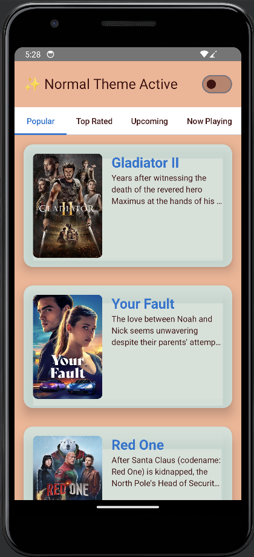
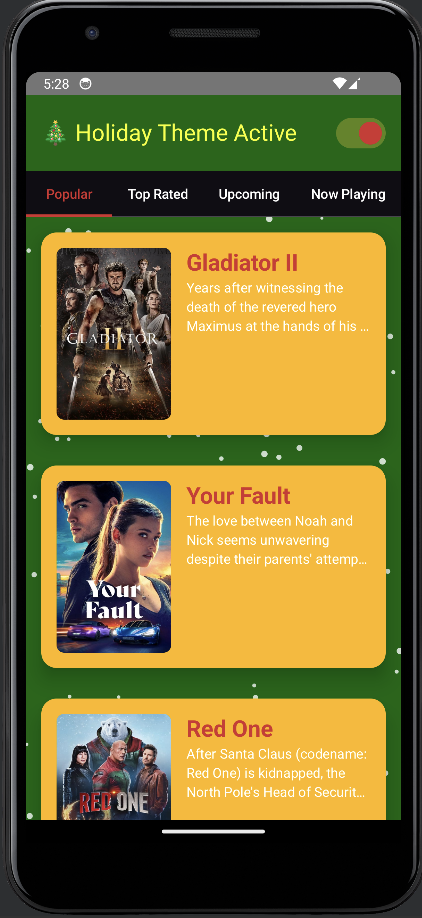
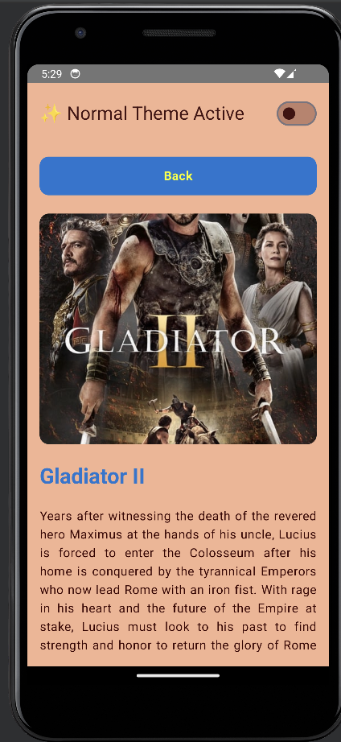
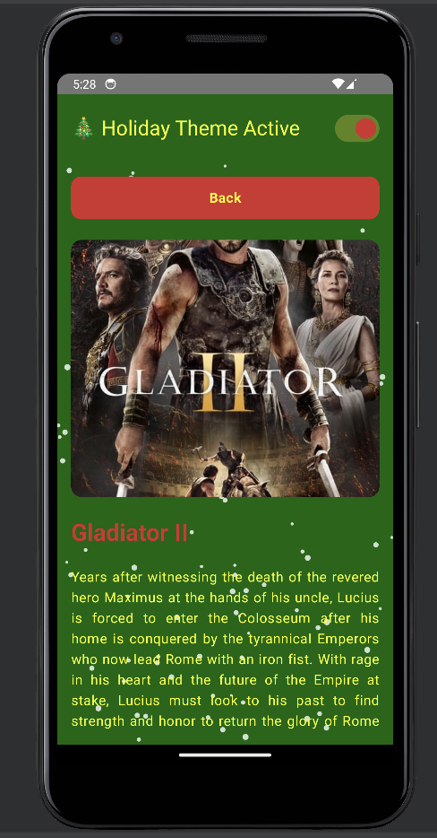

# 🎥 FlixMovieDbVerse

**FlixMovieDbVerse** is a feature-rich **movie browsing application** built with **Jetpack Compose
**. It allows users to explore trending, popular, and upcoming movies dynamically with real-time
data integration from the **TMDB API**. The app also features **dynamic theming**, **offline caching
**, and an immersive **Holiday Mode** with animated snowfall.

---

## 🚀 Features

### 🌟 Dynamic Theming

- **Light Mode**, **Dark Mode**, and **Holiday Mode**:
    - **Holiday Mode** includes:
        - Animated snowfall across all screens.
        - Festive UI with custom colors (`Gold`, `Bright Red`, `Deep Green`).

### 🎬 Comprehensive Movie Browsing

- Browse **Popular**, **Top Rated**, **Upcoming**, and **Now Playing** movies.
- Infinite scrolling with **Paging 3** integration.

### 📖 Detailed Movie Pages

- High-quality posters, movie ratings, and detailed descriptions.
- Smooth transitions between movie list and detail screens.

### 🔄 Offline Caching

- Cached movie details for offline access using **Room Database**.

### 🛠️ Error Handling

- Graceful fallback mechanisms for network issues.
- User-friendly error messages with retry options.

---

## 📱 Screenshots

| **Normal Theme**                                      | **Holiday Theme**                                       |
|-------------------------------------------------------|---------------------------------------------------------|
|          |          |
|  |  |
---

## 🛠️ Tech Stack

| **Layer**                | **Technology**                |
|--------------------------|-------------------------------|
| **Language**             | Kotlin                        |
| **UI Framework**         | Jetpack Compose               |
| **Architecture**         | MVVM + Clean Architecture     |
| **Network**              | Retrofit + Gson               |
| **Pagination**           | Paging 3                      |
| **Dependency Injection** | Hilt                          |
| **Concurrency**          | Coroutines + Flows            |
| **Offline Caching**      | Room Database                 |
| **Testing**              | JUnit + MockK + Compose Tests |

---

## 🏗️ Architecture Overview

### Modularized Clean Architecture

```plaintext
com.ezgieren.flixmoviedbverse
├── data                 # Data sources, repositories
│   ├── remote           # TMDB API integration
│   ├── local            # Room Database setup
│   ├── model            # Data transfer and domain models
├── domain               # Business logic (Use Cases)
├── presentation         # UI components and ViewModels
│   ├── screens          # Screens (MovieList, MovieDetails)
│   ├── components       # Reusable UI components
│   ├── theme            # Dynamic theming
├── di                   # Hilt modules
└── utils                # Constants and utility classes
```
---

## 🎨 Theming Highlights

```kotlin
@Composable
fun FlixMovieDbVerseTheme(
    isHolidayTheme: Boolean = false,
    darkTheme: Boolean = isSystemInDarkTheme(),
    content: @Composable () -> Unit
) {
    val colorScheme = if (isHolidayTheme) {
        darkColorScheme(
            primary = ChristmasColors.BrightRed,
            background = ChristmasColors.DeepGreen,
            surface = ChristmasColors.CardBackground
        )
    } else {
        if (darkTheme) darkColorScheme() else lightColorScheme()
    }

    MaterialTheme(colorScheme = colorScheme, content = content)
}
```

-	•	Normal Theme: Clean, minimalistic design.
-	•	Holiday Theme: Custom colors (Gold, Bright Red, Deep Green) and animated snowfall.

---

## ⚙️ Setup

- Prerequisites
    1. Android Studio Arctic Fox or later.
    2. A valid TMDB API Key.

    - Installation
        1. Clone the repository:

        ```bash
        git clone https://github.com/EzgilEren/FlixMovieDbVerse.git
         ```
        2. Open the project in Android Studio.
        3. Add your TMDB API key to Constants.kt:

      ```bash
      object Constants {
         const val API_KEY = "your_api_key_here"
      }
      ```

    4. Build and run the project on an emulator or physical device.

---

## 🧪 Testing

- Test Coverage
  • Unit Testing: Repository, Use Cases, and ViewModels.
  • UI Testing: Compose Testing Framework.

- Run all tests with:

```bash
./gradlew test
```
---

## 🤝 Contributing

- Contributions are welcome! Follow these steps to contribute:
    1. Fork the repository.
    2. Create a new feature branch:
         ```bash
          git checkout -b feature/your-feature
          ```
    3. Commit your changes:
          ```bash
        git commit -m "Add your feature"
        ```

    4. Push to the branch:

        ```bash
        git push origin feature/your-feature
        ```

    5. Open a pull request.
---

## 📜 License

- This project is licensed under the [MIT](https://choosealicense.com/licenses/mit/) License. See
  the LICENSE file for details.

---

## 🌟 Acknowledgements

	•	TMDB API: For providing movie data.
	•	Jetpack Compose: Modern UI framework.
	•	Android Developer Community: For inspiration and resources.
---